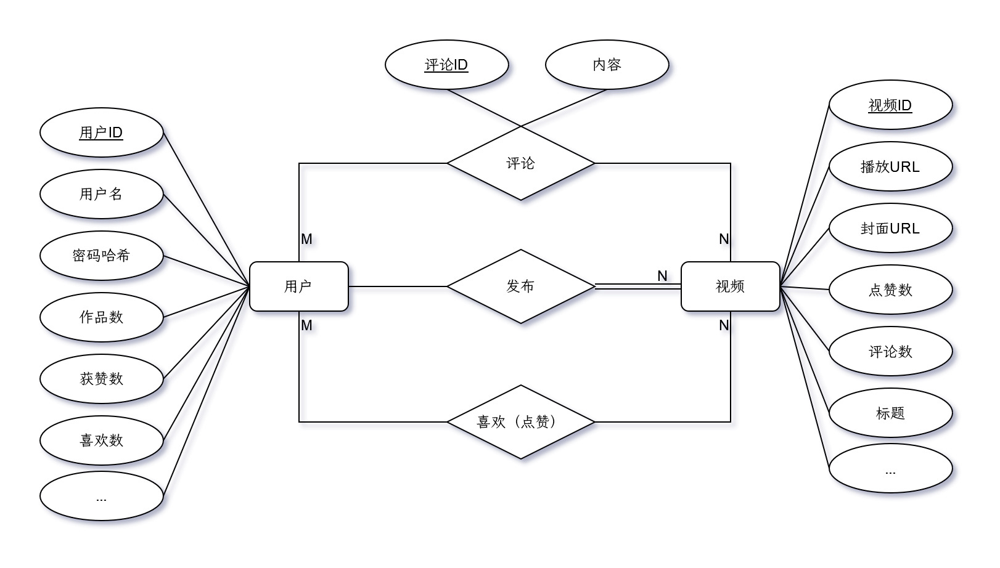

# 极简版抖音项目

## 项目介绍

项目基于 Gin + GORM 框架，实现了一个极简的单体服务版本抖音后端服务。

已经实现的接口有：

* 基础接口：
  * 视频流：`/douyin/feed/`
  
    返回按投稿时间倒序的视频列表

  * 用户注册：`/douyin/user/register/`
  * 用户登录：`/douyin/user/login/`
  * 用户信息：`/douyin/user/`
  
    返回用户信息，包括：
    * 用户ID、用户名
    * 头像图片链接，使用[retro-avatar](https://github.com/microvoid/retro-avatar)
    * 用户个人页顶部大图链接，使用[随机图片API](https://tuapi.eees.cc/)
    * 获赞数、点赞数、作品数。

  * 投稿接口：`/douyin/publish/action/`
  
    用户上传视频保存到配置文件指定的本地目录，也可保存到阿里云OSS。

  * 发布列表：`/douyin/publish/list/`

* 互动接口：
  * 点赞操作：`/douyin/favorite/action/`
  * 点赞列表：`/douyin/favorite/list/`
  * 评论操作：`/douyin/comment/action/`
  * 评论列表：`/douyin/comment/list/`

项目[地址](https://github.com/jnchen/tiny-douyin.git)

项目[服务地址]()

### 编译与运行

1. 更新依赖

    ```shell
    go mod tidy
    ```

2. 安装依赖

    ```shell
    go mod vendor
    ```

3. 编译运行

    ```shell
    go build -o bin/douyin && .bin/douyin
    ```

## 团队成员

* 曹井琛：负责项目框架技术选型，用户注册与认证相关功能开发
* 黄东海：负责视频发布相关功能、 点赞功能开发，公共代码优化
* 蒋一杭：负责评论相关功能的开发

## 项目实现

### 技术选型与相关开发文档

本项目的技术选型主要基于以下几个方面的考虑：

* 项目需求：
  
  本项目需要实现一个极简版的抖音后端服务，提供视频流、用户注册登录、视频发布、点赞评论等功能。

* 项目规模

  考虑到团队开发者能力以及用户量较小，
  因此本项目是一个单体服务，不涉及分布式架构，适合使用轻量级的 Web 框架和 ORM 框架。

* 项目周期

  本项目的开发周期较短，需要快速搭建和迭代，适合使用 Go 语言和成熟的第三方库。

* 项目成本

  服务需要能够合理地利用资源，降低运维成本和开发成本。

基于以上考虑，本项目的技术选型如下：

* 编程语言：Go
* Web 框架：Gin
* ORM 框架：GORM
* 数据库驱动：mysql
* 配置管理：viper
* 单元测试：testing
* 存储：本地或对象存储

相关开发文档如下：

* [Go 官方文档](https://golang.org/doc/)
* [Gin 官方文档](https://gin-gonic.com/docs/)
* [GORM 官方文档](https://gorm.io/docs/)
* [MySQL 官方文档](https://dev.mysql.com/doc/)
* [viper 官方文档](https://github.com/spf13/viper)
* [阿里云 OSS 官方文档](https://help.aliyun.com/zh/oss/)
* [`testing`官方文档](https://pkg.go.dev/testing)

### 架构设计

#### 业务架构

* 业务功能

  本项目主要提供以下业务功能：
  * 视频流：用户可以浏览按投稿时间倒序的视频列表。
  * 用户注册登录：用户可以使用用户名和密码注册和登录。
  * 用户信息：用户可以查看自己的个人信息，包括头像、昵称、个性签名、个人页顶部大图等。
  * 视频发布：用户可以上传视频到服务器，可以为视频添加标题信息，可以查看已发布的视频。
  * 点赞评论：用户可以对视频进行点赞或取消点赞操作，也可以发表或删除评论。
    用户可以查看自己点赞过的视频列表。

* 业务流程

  本项目的主要业务流程如下：
  * 视频流：
  
    用户打开应用后，首先看到的是视频流页面，用户可以通过上下滑动切换不同的视频。
    用户可以点击视频上的头像或用户名跳转到发布者的个人页，也可以点击右下角的菜单按钮进入其他功能页面。
    
  * 用户注册登录：
    
    用户想要进行点赞或评论操作，需要进行注册或登录操作。
    用户可以选择使用用户名和密码进行注册或登录。
    注册或登录成功后，用户会进入视频流页面，并且在后台生成一个 token 用于验证身份。
    
  * 用户信息：
    
    用户可以在菜单页面点击自己的头像或用户名进入个人信息页面，查看自己的基本信息和统计数据。
    用户也可以点击退出按钮退出当前账号，并清除本地缓存的 token。
    
  * 视频发布：
    
    用户可以在菜单页面点击发布按钮进入视频发布页面，选择从相册上传视频，然后为视频添加标题并点击发布按钮将视频信息保存到服务器。
    发布成功后，用户会返回到视频流页面。
    在个人主页可看到自己发布的视频列表。
    
  * 点赞评论：
    
    用户在观看视频时，可以通过点击右侧的心形图标进行点赞或取消点赞操作，也可以通过点击右侧的气泡图标进入评论页面发表或删除评论。
    点赞或评论成功后，会更新服务器端的数据。
    用户可在个人主页查看自己点赞过的视频列表。

* 业务实体

  本项目涉及以下几个主要的业务实体：
  
  * User：用户实体
    
    ```go
    type User struct {
      ID              int64     `gorm:"primary_key;type:bigint;auto_increment;comment:用户id"`
      Username        string    `gorm:"type:varchar(200);uniqueIndex;comment:用户登录名"`
      Password        string    `gorm:"type:varchar(100);comment:用户密码"`
      Avatar          string    `gorm:"type:varchar(512);comment:头像地址"`
      BackgroundImage string    `gorm:"type:varchar(1024);comment:背景地址"`
      Signature       string    `gorm:"type:varchar(1024);comment:个性签名"`
      TotalFavorited  int64     `gorm:"type:bigint;comment:获赞总数"`
      WorkCount       int64     `gorm:"type:bigint;comment:作品数"`
      FavoriteCount   int64     `gorm:"type:bigint;comment:喜欢数"`
      CreatedAt       time.Time `gorm:"comment:创建时间"`
      UpdatedAt       time.Time `gorm:"comment:更新时间"`
    }
    ```

  * Video: 视频实体
    
    ```go
    type Favorite struct {
      UserID    int64     `gorm:"primary_key;type:bigint;comment:用户id"`
      User      User      `gorm:"foreignKey:UserID;references:ID;association_autoupdate:false;association_autocreate:false;comment:用户信息"`
      VideoID   int64     `gorm:"primary_key;type:bigint;comment:视频id"`
      Video     Video     `gorm:"foreignKey:VideoID;references:ID;association_autoupdate:false;association_autocreate:false;comment:视频信息"`
      CreatedAt time.Time `gorm:"comment:创建时间"`
      UpdatedAt time.Time `gorm:"comment:更新时间"`
    }
    ```

* 业务实体关系

  本项目的业务实体之间的关系如下：

  

### 应用架构

本项目的应用架构如下：

* **表现层**：负责处理用户请求和响应，提供 Web 接口，使用 Gin 框架实现路由、参数校验、错误处理等功能。
  表现层的代码主要在 `controller` 和 `router` 目录下，
  其中 `controller` 目录包含了各个功能模块的控制器，负责调用服务层的方法并返回结果；
  `router` 目录包含了路由注册和中间件配置的代码，负责将不同的请求分发到对应的控制器。
* **业务层**：负责处理业务逻辑，封装各个功能模块的核心方法，使用 GORM 框架实现数据库操作和事务管理。
  服务层的代码主要在 `service` 目录下，
  其中每个文件对应一个功能模块，例如 `user.go` 负责用户相关的业务逻辑，`publish.go` 负责视频发布相关的业务逻辑等。
* **数据层**：负责定义数据模型和数据库连接，使用 GORM 框架实现数据迁移和查询优化。
  数据层的代码主要在 `db` 和 `model` 目录下，
  其中 `db` 目录包含了数据库初始化和连接池配置的代码，以及数据表结构声明；
  `model` 目录包含了各个数据实体的结构体定义和验证规则。
* **存储层**：负责存储视频文件，支持本地存储或对象存储。
  存储层的代码主要在 `storage` 目录下，
  其中 `local.go` 和 `oss.go` 分别实现了本地存储和对象存储的接口，
  `init.go` 声明了抽象存储接口，并负责根据配置文件选择存储方式并初始化存储客户端。

### 项目代码介绍

本项目根据功能划分了以下几个主要的模块：

* `config` 模块：负责读取和解析配置文件。
* `db` 模块：负责初始化和管理数据库连接，提供数据库操作的封装接口。
* `storage` 模块：负责初始化和管理存储服务，提供存储操作的封装接口。
* `model` 模块：负责定义数据模型，映射数据库表结构。
* `service` 模块：负责提供业务服务，封装业务逻辑和数据操作。
* `controller` 模块：负责处理请求和响应，调用业务服务和视图模板。
* `middleware` 模块：负责提供中间件，实现身份验证、限流等功能。
* `router` 模块：负责定义路由规则，注册控制器和中间件。
* `util` 模块：负责提供通用的工具函数，如生成 UUID、处理视频文件等。
* `test` 模块：负责编写单元测试和集成测试，覆盖主要的功能点。


### `config` 包

`config` 包负责读取和解析配置文件，使用 viper 库实现。
配置文件采用 yaml 格式，包含了数据库连接信息、存储类型和路径等参数。
`config` 包提供了一个全局变量 `Conf`，用于存储配置信息，并在 `init` 函数中初始化配置。

### `db` 包

`db` 包负责数据库的连接和操作，使用 GORM 库实现。
`db` 包定义了项目所需的数据表结构和模型，包括用户、视频、点赞、评论、消息等。
`db` 包提供了函数 `GetORM` `GetSQL`，用于h获取存储数据库连接对象，并在 `init` 函数中初始化数据库连接和迁移数据表。

### `storage` 包

`storage` 包负责视频文件的存储和读取，支持本地存储和阿里云 OSS 存储。
`storage` 包定义了一个 `Storage` 接口，用于抽象存储的行为，包括获取URL、上传、删除方法。
`storage` 包提供了两个实现了 `Storage` 接口的结构体：`Local` 和 `OSS`，分别对应本地存储和阿里云 OSS 存储。
`storage` 包提供了一个函数 `GetStorage`，用于获取当前使用的存储对象，并在 `init` 函数中根据配置文件初始化存储对象。

### `model` 包

`model` 包负责定义项目所需的数据模型和结构体，包括请求参数、响应结果、业务逻辑等。

`model` 包主要包含以下几个文件：

* `comment.go`：定义了评论相关的结构体和常量，包括评论请求参数、评论响应结果、评论列表响应结果等。
* `common.go`：定义了一些通用的结构体和常量，用于返回响应中的用户信息、视频信息、评论等。
* `favorite.go`：定义了点赞相关的结构体和常量，包括点赞请求参数、点赞响应结果、点赞列表响应结果等。
* `feed.go`：定义了视频流相关的结构体和常量，包括视频流请求参数、视频流响应结果等。
* `publish.go`：定义了视频发布相关的结构体和常量，包括视频发布请求参数、视频发布响应结果、视频发布列表响应结果等。
* `user.go`：定义了用户相关的结构体和常量，包括用户注册请求参数、用户登录请求参数、用户信息响应结果等。

### `service` 包

`service` 包负责实现项目的业务逻辑层，主要是对 `db` 包的封装和调用。

`service` 包主要包含以下几个文件：

* `comment.go`：实现了评论相关的服务函数，包括评论创建与删除、获取评论列表等。
* `favorite.go`：实现了点赞相关的服务函数，包括创建点赞、取消点赞、获取点赞列表等。
* `feed.go`：实现了视频流相关的服务函数，包括获取视频流列表等。
* `publish.go`：实现了视频发布相关的服务函数，包括创建视频、获取视频列表等。
* `user.go`：实现了用户相关的服务函数，包括创建用户、p判断用户是否存在等。
* `user_token.go`：实现了用户认证相关的服务函数，包括生成 token、验证 token 等。

### `controller` 包

`controller` 包负责实现项目的控制器层，主要是对 `service` 包的封装和调用，以及对请求参数的校验和响应结果的返回。

`controller` 包主要包含以下几个文件：

* `comment.go`：实现了评论相关的控制器函数，包括创建评论、获取评论列表等。
* `demo_data.go`：实现了一些用于测试和演示的控制器函数，包括生成测试数据、清空测试数据等。
* `favorite.go`：实现了点赞相关的控制器函数，包括创建点赞、取消点赞、获取点赞列表等。
* `feed.go`：实现了视频流相关的控制器函数，包括获取视频流列表等。
* `message.go`：实现了消息相关的控制器函数，包括获取消息列表等。
* `publish.go`：实现了视频发布相关的控制器函数，包括创建视频、获取视频列表等。
* `relation.go`：实现了关注相关的控制器函数，包括创建关注、取消关注、获取关注列表等。
* `user.go`：实现了用户相关的控制器函数，包括用户注册、用户登录、用户信息、用户更新等。

### `middleware` 包

`middleware` 包负责实现项目的中间件层，主要是对请求和响应进行一些预处理和后处理。

`middleware` 包主要包含以下几个文件：

* `auth.go`：实现了用户认证中间件，用于验证请求中的 `token` 是否有效，如果有效则将用户信息保存到上下文中，如果无效则返回错误信息。
* `ratelimit.go`：实现了请求限流中间件，如果超过限制则返回错误信息。

### `router` 包

`router` 包负责定义项目的路由层，主要是将请求路径和方法与对应的控制器函数进行绑定，并添加相应的中间件。
`router` 包提供了一个 `InitRouter` 函数，接受一个 `gin.Engine` 对象指针，用于初始化路由。

### `util` 包

`util` 包负责提供一些通用的工具函数，主要包含以下几个文件：

* `concurrent_slice.go`：实现了一个并发安全的切片结构体和方法。
* `helper.go`：实现了一些辅助函数，包括获取鉴权中间件存储的用户信息、生成随机图片链接等。
* `uuid.go`：实现了一个生成 UUID 的函数。
* `video.go`：实现了一些视频处理相关的函数，包括生成视频封面图。

### `test` 包

`test` 包负责编写项目的单元测试和集成测试，使用 `testing` 库实现。

`test` 包主要包含以下几个文件：

* `base_api_test.go`：对基础接口进行集成测试。
* `common.go`：定义了一些测试通用的函数和变量。
* `concurrent_slice_test.go`：对 `concurrent_slice.go` 文件中的代码进行单元测试。
* `interact_api_test.go`：对点赞和评论相关的接口进行集成测试。
* `videogen` 模块，用于生成测试视频。

### `main.go` 文件

`main.go` 文件是项目的入口文件，主要负责关闭数据库连接、初始化路由等，并启动服务。

## 测试结果

### 功能测试

## 项目总结与反思

1. 目前仍存在的问题

2. 已识别出的优化项

3. 架构演进的可能性

4. 项目过程中的反思与总结
